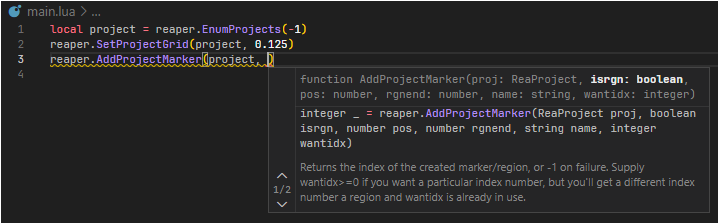
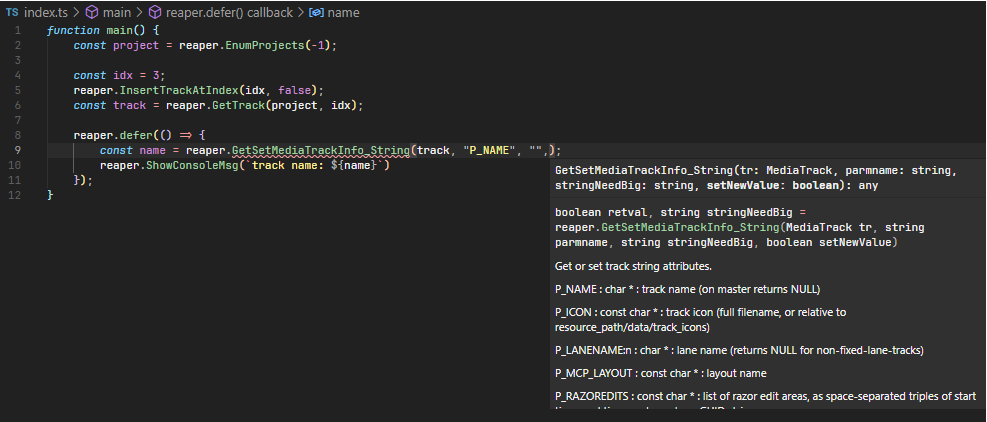

# reascript-parse

Generated Lua definitions from REAPER v7.08:

- [**Download link**](https://github.com/jamesWalker55/rs-parse/releases/tag/initial)

A parser for ReaScript documentation files. These are generated by REAPER through the menu "Help" > "ReaScript documentation".

It is recommended to use `rye` to install this script.

```sh
rye sync
```

Currently supported language outputs are:

- Lua
- TypeScript (through [TypeScriptToLua](https://github.com/TypeScriptToLua/TypeScriptToLua))

## Generating Lua Definitions



The action 'to-lua' generates a Lua declaration file containing all functions in the documentation:

```sh
# example usage:
reascript-parse to-lua reascripthelp.html reaper.lua
```

The generated file contains definitions like this:

````lua
---@diagnostic disable-next-line: lowercase-global
reaper = {
    --- ```
    --- MediaItem _ = reaper.AddMediaItemToTrack(MediaTrack tr)
    --- ```
    --- creates a new media item.
    ---@param tr MediaTrack
    ---@return MediaItem
    AddMediaItemToTrack = function(tr) end,

    -- ...

    --- ```
    --- boolean _ = reaper.AddTempoTimeSigMarker(ReaProject proj, number timepos, number bpm, integer timesig_num, integer timesig_denom, boolean lineartempochange)
    --- ```
    --- Deprecated. Use SetTempoTimeSigMarker with ptidx=-1.
    ---@param proj ReaProject
    ---@param timepos number
    ---@param bpm number
    ---@param timesig_num integer
    ---@param timesig_denom integer
    ---@param lineartempochange boolean
    ---@return boolean
    ---@deprecated
    AddTempoTimeSigMarker = function(proj, timepos, bpm, timesig_num, timesig_denom, lineartempochange) end,

    --- ```
    --- reaper.adjustZoom(number amt, integer forceset, boolean doupd, integer centermode)
    --- ```
    --- forceset=0,doupd=true,centermode=-1 for default
    ---@param amt number
    ---@param forceset integer
    ---@param doupd boolean
    ---@param centermode integer
    adjustZoom = function(amt, forceset, doupd, centermode) end,

    -- ...
````

## Generating TypeScript Definitions



This project also supports TypeScript output by using types from the [TypeScriptToLua](https://github.com/TypeScriptToLua/TypeScriptToLua) project.

The action 'to-ts' generates a TypeScript declaration file containing all functions in the documentation:

```sh
# example usage:
reascript-parse to-ts reascripthelp.html reaper.d.ts
```

The generated file contains definitions like this:

```typescript
declare namespace reaper {
  /**
   * ```
   * MediaItem _ = reaper.AddMediaItemToTrack(MediaTrack tr)
   * ```
   * creates a new media item.
   */
  function AddMediaItemToTrack(tr: MediaTrack): MediaItem;

  /**
   * ```
   * boolean _ = reaper.AddTempoTimeSigMarker(ReaProject proj, number timepos, number bpm, integer timesig_num, integer timesig_denom, boolean lineartempochange)
   * ```
   * Deprecated. Use SetTempoTimeSigMarker with ptidx=-1.
   * @deprecated
   */
  function AddTempoTimeSigMarker(proj: ReaProject, timepos: number, bpm: number, timesig_num: number, timesig_denom: number, lineartempochange: boolean): boolean;

  /**
   * ```
   * reaper.adjustZoom(number amt, integer forceset, boolean doupd, integer centermode)
   * ```
   * forceset=0,doupd=true,centermode=-1 for default
   */
  function adjustZoom(amt: number, forceset: number, doupd: boolean, centermode: number): void;

  // ...
```

## Parsing failure

The documentation is usually poorly formatted, so there are many hiccups when parsing the documentation. For example:

```log
[WARN] Optional parameter followed by required parameter in 'ImGui_InputTextWithHint', forcing all parameters to be required: 'boolean  retval,  string  buf = reaper.ImGui_InputTextWithHint( ImGui_Context  ctx,  string  label,  string  hint,  string  buf,  optional integer  flagsIn,  ImGui_Function  callbackIn)'
[INFO] Skipping section with no Lua function definition 'eel_acos'
[WARN] Failed to parse parameters with default parser due to 'malformed function parameter', trying unstable bruteforce parser: 'gfx.arc(x,y,r,ang1,ang2[,antialias])'
[WARN] Skipping malformed Lua function in section 'lua_gfx.deltablit' - failed to find params: 'gfx.deltablit(srcimg,srcs,srct,srcw,srch,destx,desty,destw,desth,dsdx,dtdx,dsdy,dtdy,dsdxdy,dtdxdy[,usecliprect=1])'
[INFO] Lua declaration file saved to: temp/reaper_appdata.lua
```

In particular, some functions with especially terrible formatting (only 3 functions so far!) will be skipped with the following log message:

```log
[WARN] Skipping malformed Lua function in section 'lua_gfx_variables' - failed to find params: 'gfx VARIABLES'
[WARN] Skipping malformed Lua function in section 'lua_gfx.deltablit' - failed to find params: 'gfx.deltablit(srcimg,srcs,srct,srcw,srch,destx,desty,destw,desth,dsdx,dtdx,dsdy,dtdy,dsdxdy,dtdxdy[,usecliprect=1])'
[WARN] Skipping malformed Lua function in section 'lua_new_array' - failed to find params: 'reaper.new_array([table|array][size])'
```

To parse the failed functions, you should manually fix the source HTML before parsing it.
